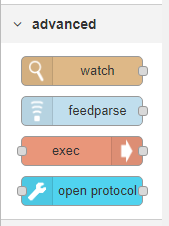
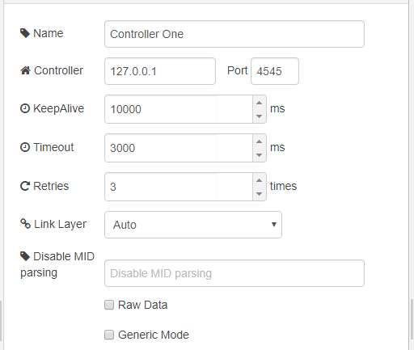
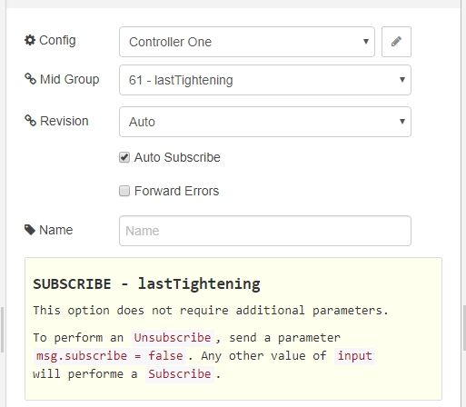
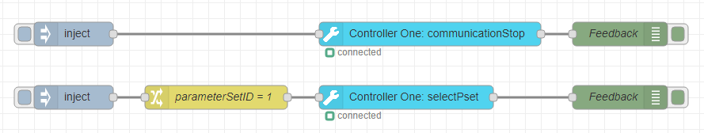
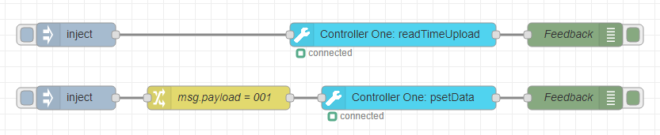
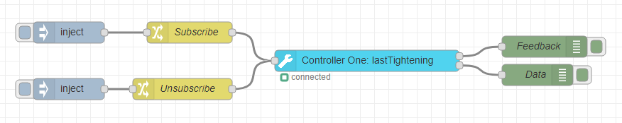
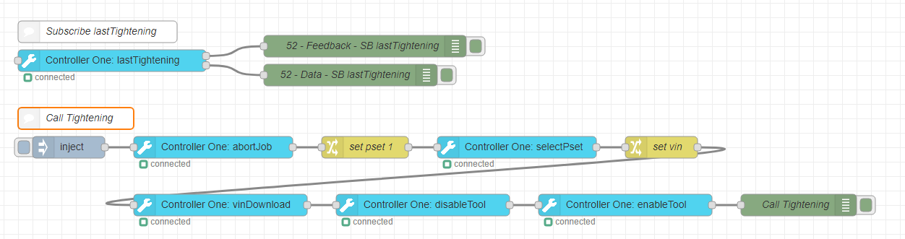
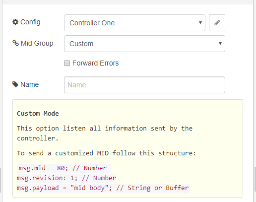
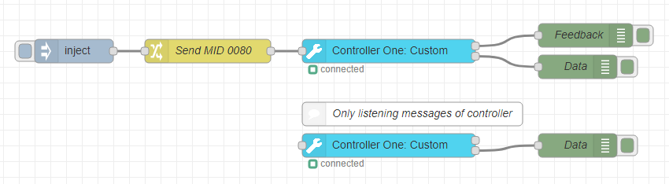

# node-red-contrib-open-protocol

A Node-RED node to interface with other systems using the Atlas Copco Open Protocol.
 
This node was created by [Smart-Tech](https://netsmarttech.com) as part of the [ST-One](https://netsmarttech.com/page/st-one) project.

## Library

This node is based on [Open Protocol Library](https://github.com/netsmarttech/node-open-protocol).

## How to install?

To install the stable version use the `Menu - Manage palette` option and search for `node-red-contrib-open-protocol`, or run the following command in your Node-RED user directory (typically `~/.node-red`):

    npm install node-red-contrib-open-protocol

## How to use?

This node stay on tab `advanced`



### Config

Start by adding a new controller configuration.



- `Controller` : ip address of controller  
- `Port` : port of controller
- `KeepAlive` : max time without communication
- `Timeout` : max time without connection
- `Retries` : retries of connection
- `Link Layer` : Link Layer mode
    - `auto` : auto negotiation
    - `true` : force link layer
    - `false` : disable link layer
- `Disable MID parsing` : receiver MIDs with body not parsing
    - Ex: 2, 5; 15
- `Raw Data`: adds the parameter `_raw` in all messages, containing the message buffer
- `Generic Mode` : The nodes use calls generics

### Node

Then configure a function to be called in the controller.



- `Config` : select controller
- `Mid Group` : select functions to this node
- `Revision` : select revision
    - `auto` : auto negotiation revision
    - `custom` : add revision not listed
- `Auto Subscribe` : call subscribe on start
- `Forward Error` : adds the parameter `msg.error`, in error cases
- `Tips` : tips for use this function

### Examples

#### Command nodes

This example shows you how to stop the communication or select a pset.



##### Code flow

```json
[{"id":"9d3da6b2.d5eab8","type":"op node","z":"7b6f6a98.c2de94","name":"","config":"5ed3e639.0e2408","midGroup":"3","customMid":"","revision":"1","customRevision":"","autoSubscribe":true,"forwardErrors":false,"x":620,"y":120,"wires":[["e5453c4f.b4c4f"]]},{"id":"d5f60435.9b81d8","type":"op node","z":"7b6f6a98.c2de94","name":"","config":"5ed3e639.0e2408","midGroup":"18","customMid":"","revision":"1","customRevision":"","autoSubscribe":true,"forwardErrors":false,"x":590,"y":200,"wires":[["c70150f8.9321a"]]},{"id":"e5453c4f.b4c4f","type":"debug","z":"7b6f6a98.c2de94","name":"Feedback","active":true,"tosidebar":true,"console":false,"tostatus":false,"complete":"true","x":860,"y":120,"wires":[]},{"id":"c70150f8.9321a","type":"debug","z":"7b6f6a98.c2de94","name":"Feedback","active":true,"tosidebar":true,"console":false,"tostatus":false,"complete":"true","x":860,"y":200,"wires":[]},{"id":"928a3d41.4b6b4","type":"inject","z":"7b6f6a98.c2de94","name":"","topic":"","payload":"","payloadType":"str","repeat":"","crontab":"","once":false,"onceDelay":0.1,"x":170,"y":120,"wires":[["9d3da6b2.d5eab8"]]},{"id":"328519f.9dd84e6","type":"inject","z":"7b6f6a98.c2de94","name":"","topic":"","payload":"","payloadType":"str","repeat":"","crontab":"","once":false,"onceDelay":0.1,"x":170,"y":200,"wires":[["46be0529.ea666c"]]},{"id":"46be0529.ea666c","type":"change","z":"7b6f6a98.c2de94","name":"parameterSetID = 1","rules":[{"t":"set","p":"payload","pt":"msg","to":"{}","tot":"json"},{"t":"set","p":"payload.parameterSetID","pt":"msg","to":"1","tot":"num"}],"action":"","property":"","from":"","to":"","reg":false,"x":350,"y":200,"wires":[["d5f60435.9b81d8"]]},{"id":"5ed3e639.0e2408","type":"op config","z":"","name":"Controller One","controllerIP":"127.0.0.1","controllerPort":"4545","keepAlive":"10000","timeout":"3000","retries":"3","disablemidparsing":"","rawData":false,"generic":false,"linkLayer":"auto"}]
```

#### Request nodes

This example shows you how to read the time from the controller or request a specific pset data.



##### Code flow

```json
[{"id":"9d3da6b2.d5eab8","type":"op node","z":"7b6f6a98.c2de94","name":"","config":"5ed3e639.0e2408","midGroup":"81","customMid":"","revision":"1","customRevision":"","autoSubscribe":true,"forwardErrors":false,"x":630,"y":120,"wires":[["e5453c4f.b4c4f"]]},{"id":"d5f60435.9b81d8","type":"op node","z":"7b6f6a98.c2de94","name":"","config":"5ed3e639.0e2408","midGroup":"13","customMid":"","revision":"1","customRevision":"","autoSubscribe":true,"forwardErrors":false,"x":650,"y":200,"wires":[["c70150f8.9321a"]]},{"id":"e5453c4f.b4c4f","type":"debug","z":"7b6f6a98.c2de94","name":"Feedback","active":true,"tosidebar":true,"console":false,"tostatus":false,"complete":"true","x":860,"y":120,"wires":[]},{"id":"c70150f8.9321a","type":"debug","z":"7b6f6a98.c2de94","name":"Feedback","active":true,"tosidebar":true,"console":false,"tostatus":false,"complete":"true","x":860,"y":200,"wires":[]},{"id":"928a3d41.4b6b4","type":"inject","z":"7b6f6a98.c2de94","name":"","topic":"","payload":"","payloadType":"str","repeat":"","crontab":"","once":false,"onceDelay":0.1,"x":230,"y":120,"wires":[["9d3da6b2.d5eab8"]]},{"id":"328519f.9dd84e6","type":"inject","z":"7b6f6a98.c2de94","name":"","topic":"","payload":"","payloadType":"str","repeat":"","crontab":"","once":false,"onceDelay":0.1,"x":230,"y":200,"wires":[["46be0529.ea666c"]]},{"id":"46be0529.ea666c","type":"change","z":"7b6f6a98.c2de94","name":"msg.payload = 001","rules":[{"t":"set","p":"payload","pt":"msg","to":"001","tot":"str"}],"action":"","property":"","from":"","to":"","reg":false,"x":410,"y":200,"wires":[["d5f60435.9b81d8"]]},{"id":"5ed3e639.0e2408","type":"op config","z":"","name":"Controller One","controllerIP":"127.0.0.1","controllerPort":"4545","keepAlive":"10000","timeout":"3000","retries":"3","disablemidparsing":"","rawData":false,"generic":false,"linkLayer":"auto"}]
```

#### Subscribe and Unsubscribe nodes

This example shows you how to subscribe/unsubscribe to receive the last tightening data.



##### Code flow

```json
[{"id":"d5f60435.9b81d8","type":"op node","z":"7b6f6a98.c2de94","name":"","config":"5ed3e639.0e2408","midGroup":"61","customMid":"","revision":"1","customRevision":"","autoSubscribe":true,"forwardErrors":false,"x":670,"y":240,"wires":[["c70150f8.9321a"],["276df28e.7ae56e"]]},{"id":"c70150f8.9321a","type":"debug","z":"7b6f6a98.c2de94","name":"Feedback","active":true,"tosidebar":true,"console":false,"tostatus":false,"complete":"true","x":920,"y":220,"wires":[]},{"id":"328519f.9dd84e6","type":"inject","z":"7b6f6a98.c2de94","name":"","topic":"","payload":"","payloadType":"str","repeat":"","crontab":"","once":false,"onceDelay":0.1,"x":250,"y":200,"wires":[["46be0529.ea666c"]]},{"id":"46be0529.ea666c","type":"change","z":"7b6f6a98.c2de94","name":"Subscribe","rules":[{"t":"set","p":"subscribe","pt":"msg","to":"true","tot":"bool"}],"action":"","property":"","from":"","to":"","reg":false,"x":420,"y":200,"wires":[["d5f60435.9b81d8"]]},{"id":"276df28e.7ae56e","type":"debug","z":"7b6f6a98.c2de94","name":"Data","active":true,"tosidebar":true,"console":false,"tostatus":false,"complete":"true","x":910,"y":260,"wires":[]},{"id":"bd75d590.9bab18","type":"change","z":"7b6f6a98.c2de94","name":"Unsubscribe","rules":[{"t":"set","p":"subscribe","pt":"msg","to":"false","tot":"bool"}],"action":"","property":"","from":"","to":"","reg":false,"x":410,"y":280,"wires":[["d5f60435.9b81d8"]]},{"id":"66c9b977.3aa4e8","type":"inject","z":"7b6f6a98.c2de94","name":"","topic":"","payload":"","payloadType":"str","repeat":"","crontab":"","once":false,"onceDelay":0.1,"x":250,"y":280,"wires":[["bd75d590.9bab18"]]},{"id":"5ed3e639.0e2408","type":"op config","z":"","name":"Controller One","controllerIP":"127.0.0.1","controllerPort":"4545","keepAlive":"10000","timeout":"3000","retries":"3","disablemidparsing":"","rawData":false,"generic":false,"linkLayer":"auto"}]
```

#### Call Tightening

This example shows you how to automatically subscribe to the last tightening data and also select a pset and vin number in the controller. 



##### Code flow

```json
[{"id":"81a5a4b0.7cbbe8","type":"inject","z":"a81546a3.dc0b38","name":"","topic":"","payload":"","payloadType":"str","repeat":"","crontab":"","once":false,"onceDelay":0.1,"x":150,"y":280,"wires":[["39320997.956306"]]},{"id":"39320997.956306","type":"op node","z":"a81546a3.dc0b38","name":"","config":"19263555.44deab","midGroup":"127","customMid":"","revision":"Auto","customRevision":"","autoSubscribe":true,"forwardErrors":false,"x":350,"y":280,"wires":[["7c8718d9.d4ec08"]]},{"id":"923d67c5.318b88","type":"op node","z":"a81546a3.dc0b38","name":"","config":"19263555.44deab","midGroup":"18","customMid":"","revision":"1","customRevision":"","autoSubscribe":true,"forwardErrors":false,"x":770,"y":280,"wires":[["c3e9827.5a5bd8"]]},{"id":"a1e0259a.3c1718","type":"op node","z":"a81546a3.dc0b38","name":"","config":"19263555.44deab","midGroup":"50","customMid":"","revision":"1","customRevision":"","autoSubscribe":true,"forwardErrors":false,"x":360,"y":360,"wires":[["4656e43c.57b15c"]]},{"id":"4656e43c.57b15c","type":"op node","z":"a81546a3.dc0b38","name":"","config":"19263555.44deab","midGroup":"42","customMid":"","revision":"1","customRevision":"","autoSubscribe":true,"forwardErrors":false,"x":640,"y":360,"wires":[["577327b3.02f2b8"]]},{"id":"577327b3.02f2b8","type":"op node","z":"a81546a3.dc0b38","name":"","config":"19263555.44deab","midGroup":"43","customMid":"","revision":"Auto","customRevision":"","autoSubscribe":true,"forwardErrors":false,"x":920,"y":360,"wires":[["cc646f7.c3c019"]]},{"id":"7c8718d9.d4ec08","type":"change","z":"a81546a3.dc0b38","name":"set pset 1","rules":[{"t":"set","p":"payload","pt":"msg","to":"{}","tot":"json"},{"t":"set","p":"payload.parameterSetID","pt":"msg","to":"1","tot":"num"}],"action":"","property":"","from":"","to":"","reg":false,"x":560,"y":280,"wires":[["923d67c5.318b88"]]},{"id":"c3e9827.5a5bd8","type":"change","z":"a81546a3.dc0b38","name":"set vin","rules":[{"t":"set","p":"payload","pt":"msg","to":"{}","tot":"json"},{"t":"set","p":"payload.numberVIN","pt":"msg","to":"ASDEDCUHBG34563EDFRCVGFR6","tot":"str"}],"action":"","property":"","from":"","to":"","reg":false,"x":970,"y":280,"wires":[["a1e0259a.3c1718"]]},{"id":"cc646f7.c3c019","type":"debug","z":"a81546a3.dc0b38","name":"Call Tightening","active":true,"tosidebar":true,"console":false,"tostatus":false,"complete":"true","x":1160,"y":360,"wires":[]},{"id":"71f9e354.6c495c","type":"op node","z":"a81546a3.dc0b38","name":"","config":"19263555.44deab","midGroup":"61","customMid":"","revision":"Auto","customRevision":"","autoSubscribe":true,"forwardErrors":true,"x":210,"y":160,"wires":[["e510f0b0.b0e43"],["95576443.d45b38"]]},{"id":"e510f0b0.b0e43","type":"debug","z":"a81546a3.dc0b38","name":"52 - Feedback - SB lastTightening","active":true,"tosidebar":true,"console":false,"tostatus":false,"complete":"true","x":560,"y":140,"wires":[]},{"id":"95576443.d45b38","type":"debug","z":"a81546a3.dc0b38","name":"52 - Data - SB lastTightening","active":true,"tosidebar":true,"console":false,"tostatus":false,"complete":"true","x":540,"y":180,"wires":[]},{"id":"72f6929a.4b969c","type":"comment","z":"a81546a3.dc0b38","name":"Subscribe lastTightening","info":"","x":190,"y":120,"wires":[]},{"id":"f02ddef6.58705","type":"comment","z":"a81546a3.dc0b38","name":"Call Tightening","info":"","x":160,"y":240,"wires":[]},{"id":"19263555.44deab","type":"op config","z":"","name":"Controller One","controllerIP":"127.0.0.1","controllerPort":"4545","keepAlive":"10000","timeout":"3000","retries":"3","disablemidparsing":"","rawData":false,"generic":false,"linkLayer":"auto"}]
```

### Node Custom

This option listen all information sent by the controller and is possible send a customized MID.

To send a customized MID follow this structure:

```javascript
msg.mid = 80; // Number
msg.revision = 1; // Number
msg.payload = "mid body"; // String or Buffer
```



#### Example



#### Code flow

```json
[{"id":"d5f60435.9b81d8","type":"op node","z":"7b6f6a98.c2de94","name":"","config":"5ed3e639.0e2408","midGroup":"Custom","customMid":"","revision":"1","customRevision":"","autoSubscribe":false,"forwardErrors":false,"x":690,"y":200,"wires":[["c70150f8.9321a"],["276df28e.7ae56e"]]},{"id":"c70150f8.9321a","type":"debug","z":"7b6f6a98.c2de94","name":"Feedback","active":true,"tosidebar":true,"console":false,"tostatus":false,"complete":"true","x":940,"y":180,"wires":[]},{"id":"276df28e.7ae56e","type":"debug","z":"7b6f6a98.c2de94","name":"Data","active":true,"tosidebar":true,"console":false,"tostatus":false,"complete":"true","x":930,"y":220,"wires":[]},{"id":"bd75d590.9bab18","type":"change","z":"7b6f6a98.c2de94","name":"Send MID 0080","rules":[{"t":"set","p":"payload","pt":"msg","to":"","tot":"str"},{"t":"set","p":"mid","pt":"msg","to":"80","tot":"num"},{"t":"set","p":"revision","pt":"msg","to":"1","tot":"num"}],"action":"","property":"","from":"","to":"","reg":false,"x":460,"y":200,"wires":[["d5f60435.9b81d8"]]},{"id":"66c9b977.3aa4e8","type":"inject","z":"7b6f6a98.c2de94","name":"","topic":"","payload":"","payloadType":"str","repeat":"","crontab":"","once":false,"onceDelay":0.1,"x":290,"y":200,"wires":[["bd75d590.9bab18"]]},{"id":"373205bb.223efa","type":"op node","z":"7b6f6a98.c2de94","name":"","config":"5ed3e639.0e2408","midGroup":"Custom","customMid":"","revision":"1","customRevision":"","autoSubscribe":false,"forwardErrors":false,"x":690,"y":320,"wires":[[],["37263aae.f0dd26"]]},{"id":"37263aae.f0dd26","type":"debug","z":"7b6f6a98.c2de94","name":"Data","active":true,"tosidebar":true,"console":false,"tostatus":false,"complete":"true","x":930,"y":320,"wires":[]},{"id":"be8a31b9.37681","type":"comment","z":"7b6f6a98.c2de94","name":"Only listening messages of controller","info":"","x":720,"y":280,"wires":[]},{"id":"5ed3e639.0e2408","type":"op config","z":"","name":"Controller One","controllerIP":"127.0.0.1","controllerPort":"4545","keepAlive":"10000","timeout":"3000","retries":"3","disablemidparsing":"","rawData":false,"generic":false,"linkLayer":"auto"}]
```


## License
Copyright: (c) 2018-2020, Smart-Tech

GNU General Public License v3.0+ (see [LICENSE](LICENSE) or https://www.gnu.org/licenses/gpl-3.0.txt)